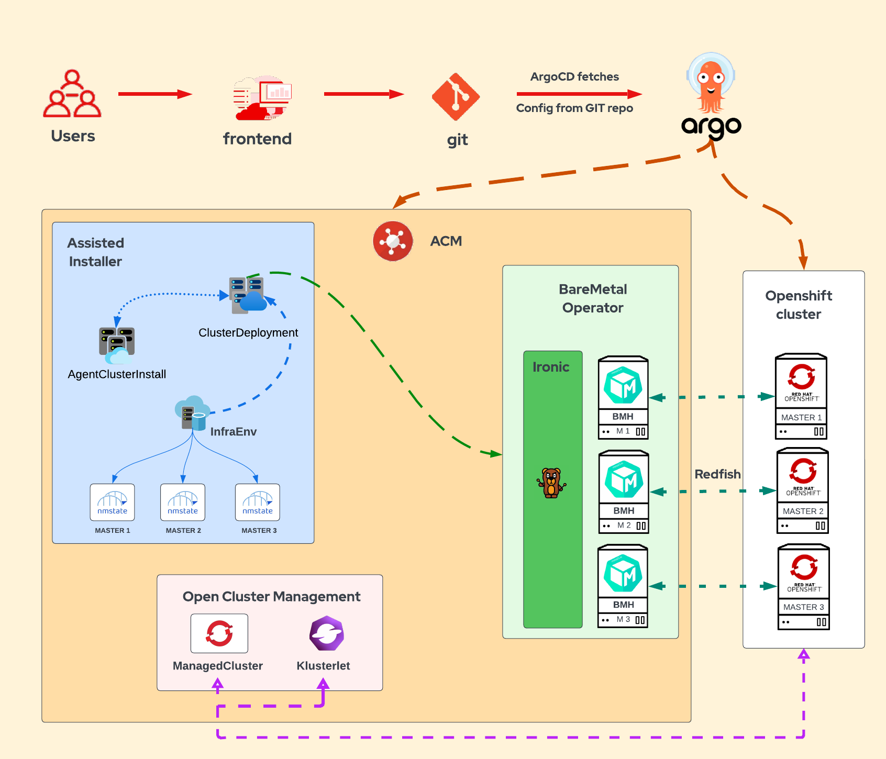
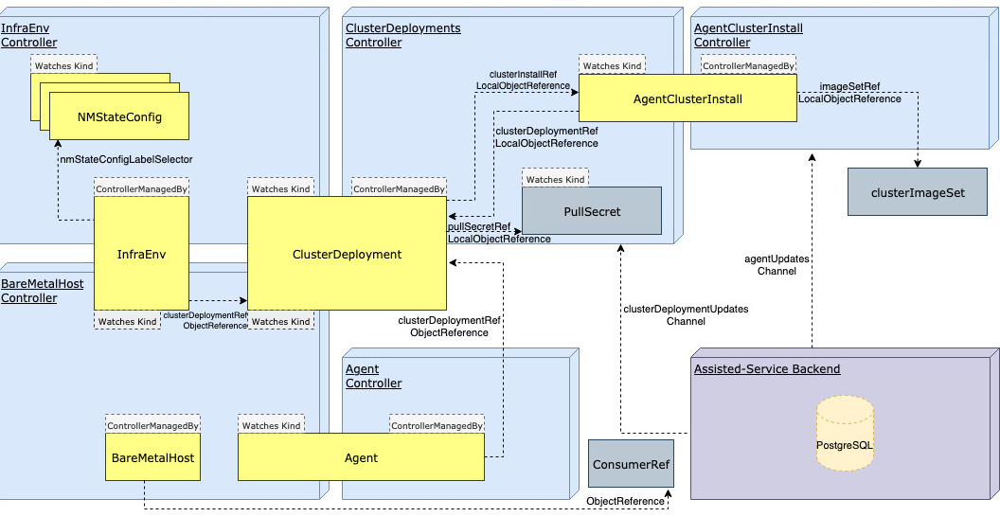

# Provisioning Baremetal OpenShift clusters using GitOps with ACM leveraging on-premise Assisted Installer

Recently, I published the blog [Provisioning OpenShift clusters using GitOps with ACM](https://cloud.redhat.com/blog/provisioning-openshift-clusters-using-gitops-with-acm) explaining how to  create OpenShift clusters with ACM using Gitops with ArgoCD. The OpenShift installation type was IPI, and valid for most of the platforms: Azure, AWS, GCP, vSphere… but not for baremetal. If you’ve ever installed an OpenShift cluster in baremetal and disconnected, you know how different it is from any other installation.

In this blog, I’ll explain how to deploy a baremetal OpenShift cluster with Assisted Installer using ACM and GitOps with ArgoCD. If you are not familiar with deploying OpenShift clusters with ACM and Gitops, I recommend reading the article I wrote: [GitOps for organizations: provisioning and configuring OpenShift clusters automatically](https://cloud.redhat.com/blog/gitops-for-organizations-provisioning-and-configuring-openshift-clusters-automatically). I also highly recommend reading the blog [Managing OCP Infrastructures Using GitOps](https://myopenshiftblog.com/managing-ocp-infrastructures-using-gitops-part-1/), which I used the first time I deployed this solution.

## Solution Overview

We’ll use OpenShift Gitops and ACM in the same way as we did in [Provisioning OpenShift clusters using GitOps with ACM](https://cloud.redhat.com/blog/provisioning-openshift-clusters-using-gitops-with-acm): we’ll upload the Kubernetes objects to our git repository, ArgoCD will synchronize these object to our OpenShift cluster, and ACM will deploy the cluster leveraging Baremetal Operator, Ironic and Assisted Installer. 

We’ll create the BareMetalHosts (BMH), which are Metal³ Custom Resource Definitions (CRDs) that define a physical host and its properties. The BMHs will connect to the baseboard management controller (BMC) physical nodes using the Redfish protocol. The node’s network will be statically configured using NMstateConfig. The OpenShift cluster will be deployed with Assisted Installer using the BareMetalHosts created.

Don’t start creating all the objects. As there are many resources involved, we recommend creating them one at a time and checking their status. Start checking the [prerequisites](https://access.redhat.com/documentation/en-us/red_hat_advanced_cluster_management_for_kubernetes/2.8/html/clusters/cluster_mce_overview#infra-env-prerequisites) before creating an infrastructure environment in ACM documentation, and enable the Central Infrastructure Management service, which is provided with the Multicluster Engine. 

Once prerequisites have been fulfilled, move to the ACM console. In the Infrastructure Environment, create and connect the Baremetal Hosts to the host’s BMC with Redfish. And then, deploy a cluster using the Baremetal Hosts (existing discovered hosts) following [Creating your cluster in ACM with the console](https://access.redhat.com/documentation/en-us/red_hat_advanced_cluster_management_for_kubernetes/2.8/html/clusters/cluster_mce_overview#on-prem-creating-your-cluster-with-the-console). Check the objects created in the deployment, and deploy another cluster creating the same objects with other parameters following [Creating your cluster in ACM with the command line](https://access.redhat.com/documentation/en-us/red_hat_advanced_cluster_management_for_kubernetes/2.8/html/clusters/cluster_mce_overview#on-prem-creating-your-cluster-with-the-cli). After that, upload the yaml files to your git repo, and create an ArgoCD Application to sync the objects. 

The last step would be to create a Helm chart with all the objects as templates, and an ApplicationSet to create an Application per cluster as we did in [Provisioning OpenShift clusters using GitOps with ACM](https://cloud.redhat.com/blog/provisioning-openshift-clusters-using-gitops-with-acm).

## Baremetal Operator, Ironic and Assisted Installer in ACM

[Bare Metal Operator](https://docs.openshift.com/container-platform/4.13/post_installation_configuration/bare-metal-configuration.html#bmo-about-the-bare-metal-operator_post-install-bare-metal-configuration) is the main component that interfaces with the Ironic API for all operations needed to provision bare-metal hosts, such as hardware capabilities inspection, operating system installation, and re-initialization when restoring a bare-metal machine to its original status.

### [Ironic](https://book.metal3.io/ironic/introduction.html) is a service for automating provisioning and lifecycle management of bare metal machines.

The [OpenShift Assisted Installer](https://github.com/openshift/assisted-installer) provides for easy provisioning of new bare metal machines and creation of OpenShift clusters.  The Assisted Installer ensures that all the hosts meet the requirements and triggers the OpenShift Container Platform cluster deployment. All the nodes (BMHs) have the Red Hat Enterprise Linux CoreOS (RHCOS) image written to the disk. 

The [Assisted Image Service](https://github.com/openshift/assisted-image-service) customizes and serves RHCOS images for the Assisted Installer Service. It downloads a set of RHCOS images on startup based on config.

The assisted installer provisioning workflow:

## Objects

In the ACM documentation chapter [Creating your cluster with the command line](https://access.redhat.com/documentation/en-us/red_hat_advanced_cluster_management_for_kubernetes/2.8/html/clusters/cluster_mce_overview#on-prem-creating-your-cluster-with-the-cli), you can get all the objects needed to deploy the cluster with Assisted Installer:

* [Namespace](https://access.redhat.com/documentation/en-us/red_hat_advanced_cluster_management_for_kubernetes/2.8/html/clusters/cluster_mce_overview#on-prem-creating-your-cluster-with-the-cli-namespace)
* [ClusterImageSet](https://access.redhat.com/documentation/en-us/red_hat_advanced_cluster_management_for_kubernetes/2.8/html/clusters/cluster_mce_overview#on-prem-creating-your-cluster-with-the-cli-cluster-image-set)
* [ClusterDeployment](https://access.redhat.com/documentation/en-us/red_hat_advanced_cluster_management_for_kubernetes/2.8/html/clusters/cluster_mce_overview#on-prem-creating-your-cluster-with-the-cli-clusterdeployment)
* [AgentClusterInstall](https://access.redhat.com/documentation/en-us/red_hat_advanced_cluster_management_for_kubernetes/2.8/html/clusters/cluster_mce_overview#on-prem-creating-your-cluster-with-the-cli-agentclusterinstall)
* [NMStateConfig](https://access.redhat.com/documentation/en-us/red_hat_advanced_cluster_management_for_kubernetes/2.8/html/clusters/cluster_mce_overview#on-prem-creating-your-cluster-with-the-cli-nmstateconfig)
* [BaremetalHost](https://access.redhat.com/documentation/en-us/red_hat_advanced_cluster_management_for_kubernetes/2.8/html/clusters/cluster_mce_overview#hosted-bare-metal-adding-agents-metal3)
* [InfraEnv](https://access.redhat.com/documentation/en-us/red_hat_advanced_cluster_management_for_kubernetes/2.8/html/clusters/cluster_mce_overview#on-prem-creating-your-cluster-with-the-cli-infraenv)
* [KlusterletAddonConfig](https://access.redhat.com/documentation/en-us/red_hat_advanced_cluster_management_for_kubernetes/2.8/html/clusters/cluster_mce_overview#importing-the-klusterlet)
* [ManagedCluster](https://access.redhat.com/documentation/en-us/red_hat_advanced_cluster_management_for_kubernetes/2.8/html/clusters/cluster_mce_overview#preparing-cluster-import)

## Useful Tips

As I said before, don’t start creating all the objects. Start checking the prerequisites, and specially with the connectivity between out-of-band management host IP addresses and ACM. For virtualmedia, you’ll need to [open the port 6183](https://docs.openshift.com/container-platform/4.13/installing/installing_bare_metal_ipi/ipi-install-prerequisites.html#network-requirements-out-of-band_ipi-install-prerequisites). The troubleshooting with virtualmedia, assisted-agent and ignition can be difficult, so try to get access to the host ILO and a virtual terminal. This will make it much easier to troubleshoot.

And the last tip: you can contact Red Hat Professional services for assistance. Although we openly share knowledge publishing blogs, solutions and articles like this one, each environment has its own customizations and challenges, and we have wide experience with a lot of customers all over the world.

## Summary

We’ve deployed a baremetal OpenShift cluster using ACM and on-premise assisted installer. First, we’ve checked the prerequisites, then we’ve created the Baremetal hosts and the cluster using ACM UI. After that, we’ve created the objects in the ACM cluster. Next, we’ve created the objects in our Git repository, and we’ve synchronized the objects to our ACM cluster with ArgoCD. At last, we’ve created a Helm Chart and an ArgoCD ApplicationSet to deploy baremetal clusters automatically.