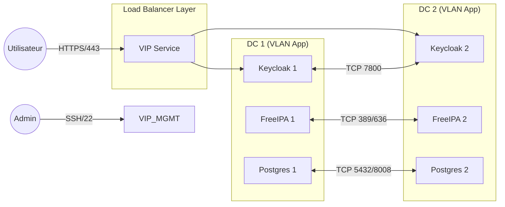

Voici le document HLD complet et consolidé au format Markdown. Vous pouvez copier-coller ce bloc directement dans un éditeur de texte (VS Code, Obsidian, etc.) ou un outil de documentation.

***

# High Level Design (HLD) : Solution d'Authentification MFA Résiliente

**Projet :** Infrastructure IAM Multi-Datacenter (Active/Active)
**Date :** 28/11/2025
**Version :** 1.1
**Auteur :** Architecte Infrastructure & Open Source

***

## 1. Résumé Exécutif

Ce document décrit l'architecture technique pour la mise en œuvre d'une solution d'authentification centralisée (SSO/MFA) haute disponibilité. La solution repose sur une stack Open Source (Keycloak, FreeIPA, PostgreSQL) déployée sur deux Datacenters (DC) géographiquement distants.

### 1.1 Objectifs et Contraintes
*   **Objectif :** Fournir un service d'identité résilient face à la perte d'une VM ou d'un Datacenter complet.
*   **Topologie :** 2 Datacenters interconnectés.
*   **Contrainte Critique :** Absence de troisième site "Témoin" (Witness). L'architecture physique se limite à **2 sites (DC1, DC2)**, ce qui implique une gestion spécifique des risques de "Split-Brain" (partitionnement réseau) et de Quorum.

***

## 2. Architecture Logique

La solution est composée de trois clusters fonctionnels indépendants, chacun "étiré" (stretched) sur les deux datacenters.

### 2.1 Composants de la Solution
1.  **Annuaire (Identity Store) :** **FreeIPA**
    *   Rôle : Gestion des identités utilisateurs, groupes, politiques, PKI.
    *   Architecture : Cluster de 2 nœuds en **Multi-Master Replication**.
2.  **Fournisseur d'Identité (IdP) :** **Keycloak**
    *   Rôle : Fédération d'identité (OIDC/SAML), MFA, Portail utilisateur.
    *   Architecture : Cluster de 2 nœuds en mode **Actif/Actif** avec synchronisation de cache distribué (Infinispan).
3.  **Base de Données :** **PostgreSQL avec Patroni**
    *   Rôle : Persistance des configurations Keycloak (Realms, Clients, Sessions offline).
    *   Architecture : Cluster de 2 nœuds en mode **Master/Slave** géré par l'orchestrateur Patroni.

### 2.2 Diagramme d'Architecture Global

```mermaid
graph TD
    subgraph "Zone Publique / DMZ"
        LB[Global Load Balancer / VIP]
    end

    subgraph "Datacenter 1 (DC1)"
        subgraph "ESX Node A"
            KC1[Keycloak Node 1]
            IPA1[FreeIPA Master 1]
            DB1[Postgres Primary + Patroni]
        end
    end

    subgraph "Datacenter 2 (DC2)"
        subgraph "ESX Node B"
            KC2[Keycloak Node 2]
            IPA2[FreeIPA Master 2]
            DB2[Postgres Standby + Patroni]
        end
    end

    %% Flux Clients
    LB -->|HTTPS| KC1
    LB -->|HTTPS| KC2
    
    %% Flux Applicatifs Internes
    KC1 -->|LDAPS| IPA1
    KC2 -->|LDAPS| IPA2
    KC1 -->|JDBC Write| DB1
    KC2 -->|JDBC Write| DB1
    
    %% Flux de Réplication Inter-DC (Stretched)
    KC1 <==>|Infinispan Sync (TCP 7800)| KC2
    IPA1 <==>|Multi-Master Repl (TCP 389/636)| IPA2
    DB1 <==>|Streaming Repl (TCP 5432)| DB2
```

***

## 3. Architecture Réseau et Flux

Cette section détaille la connectivité requise. Dans une architecture active/active sur 2 sites, la latence réseau est le facteur critique de stabilité.

**Prérequis Latence Inter-DC :** < 10 ms (Recommandé pour la réplication synchrone).

### 3.1 Diagramme des Flux Réseau



### 3.2 Matrice des Flux (Firewalling)

#### A. Flux Entrants (Clients vers Infrastructure)
| Source | Destination | Port | Protocole | Description |
| :--- | :--- | :--- | :--- | :--- |
| **Internet / Intranet** | **Load Balancer VIP** | 443 | TCP | Accès portail MFA (HTTPS). |
| **Load Balancer** | **Keycloak Nodes** | 8080 / 8443 | TCP | Redirection trafic applicatif vers les nœuds. |
| **Load Balancer** | **FreeIPA Nodes** | 80, 443 | TCP | Interface Web FreeIPA, API. |
| **Clients LDAP** | **FreeIPA Nodes** | 389, 636 | TCP | Requêtes d'annuaire (LDAP/S). |
| **Clients Kerberos** | **FreeIPA Nodes** | 88, 464 | TCP/UDP | Authentification Kerberos (KDC). |

#### B. Flux de Réplication Inter-Datacenter (Back-end)
Ces ports doivent être ouverts entre le VLAN DC1 et le VLAN DC2.

| Composant | Port | Protocole | Description |
| :--- | :--- | :--- | :--- |
| **FreeIPA** | 389, 636 | TCP | Réplication LDAP (Directory Server). |
| **Keycloak** | **7800** | TCP | **Infinispan JGroups**. Synchronisation des caches/sessions. *Note : Utiliser TCP (pas UDP) pour le WAN.* |
| **PostgreSQL** | 5432 | TCP | Streaming Replication (Données). |
| **Patroni** | 8008 | TCP | API REST Patroni (Leader election / Health check). |

#### C. Flux Applicatifs Internes (Intra-Cluster)
| Source | Destination | Port | Description |
| :--- | :--- | :--- | :--- |
| **Keycloak** | **FreeIPA** | 636 (LDAPS) | User Federation (Validation login/password). |
| **Keycloak** | **PostgreSQL** | 5432 | Lecture/Écriture configuration et sessions offline. |

***

## 4. Détail de la Configuration des Clusters

### 4.1 Cluster FreeIPA
*   **Mode :** Multi-Master complet.
*   **Résilience :** Architecture nativement active/active. Chaque nœud détient une copie complète de l'annuaire.
*   **Failover :** Transparent pour les clients (si configurés avec failover LDAP ou via LB).

### 4.2 Cluster Keycloak
*   **Mode :** Standalone-HA ou Cluster.
*   **Cache :** Infinispan distribué.
*   **Configuration spécifique 2 nœuds :** Il est recommandé de configurer les caches (`sessions`, `authenticationSessions`, `loginFailures`) avec `owners=2`. Cela garantit que chaque nœud possède une copie de toutes les données, évitant la perte de session si un nœud tombe.
*   **Discovery :** Utilisation de `JDBC_PING` (via la DB) pour que les nœuds se découvrent sans multicast.

### 4.3 Cluster PostgreSQL (Patroni)
*   **Orchestration :** Patroni gère le cycle de vie de Postgres (promotion, fencing).
*   **Proxy d'accès :** Un HAProxy local (sur les nœuds Keycloak ou DB) écoute sur le port 5432 et redirige vers le Maître actuel détecté via l'API Patroni (port 8008).

***

## 5. Analyse des Risques : Le "Split-Brain"

L'absence de site Witness (3ème site) rend impossible l'atteinte d'un Quorum automatique (Majorité > 50%) en cas de partitionnement réseau.

### 5.1 Scénarios de Défaillance

| Incident | Comportement Système | Action Requise |
| :--- | :--- | :--- |
| **Perte d'un Nœud (VM)** | **Nominal.** L'autre nœud assure 100% du service. Le cluster Patroni bascule automatiquement si le Master est perdu. | Remplacement/Redémarrage de la VM. |
| **Coupure Lien Réseau Inter-DC** | **Split-Brain.** <br>1. **Keycloak :** Les clusters s'isolent. Les sessions ne sont plus synchronisées. Risque que l'utilisateur soit déconnecté s'il change de DC via le LB.<br>2. **PostgreSQL :** Le Slave (DC2) ne voit plus le Master. Sans quorum, il ne s'auto-promeut PAS (pour protéger les données). Le Master (DC1) peut se mettre en "Read-Only" ou rester actif selon config. | Intervention réseau urgente. Réconciliation des données potentiellement complexe. |
| **Perte Totale du DC1 (Site Master)** | **Interruption Service Base de Données.** Le DC2 est vivant mais la DB est en lecture seule (Slave) car Patroni ne peut pas valider qu'il est le seul survivant. | **Bascule Manuelle (Disaster Recovery).** L'administrateur doit exécuter une commande Patroni sur DC2 pour forcer la promotion. |

### 5.2 Stratégie de Mitigation
1.  **Procédure de Secours (DRP) :** Rédiger et tester une procédure de bascule manuelle pour PostgreSQL/Patroni.
2.  **Configuration Patroni :**
    *   Configurer `pause: true` ou des timeouts élevés pour éviter des bascules intempestives lors de micro-coupures.
    *   Ne pas utiliser de "Watchdog" matériel trop agressif.

***

## 6. Dimensionnement (Capacity Planning)

Estimations pour un environnement standard de production (jusqu'à 10k utilisateurs).

| Rôle | CPU (vCore) | RAM (Go) | Disque (Go) | OS |
| :--- | :--- | :--- | :--- | :--- |
| **FreeIPA** | 2 - 4 | 8 | 50 | RHEL/Alma/Rocky 9 |
| **Keycloak** | 4 | 8 - 16 | 20 | RHEL/Alma/Rocky 9 |
| **PostgreSQL** | 4 | 8 - 16 | 100 (SSD Performance) | RHEL/Alma/Rocky 9 |

***

## 7. Conclusion

Cette architecture "2-Datacenters Stretched" est viable et offre une haute résilience locale. Cependant, le client doit valider explicitement le risque lié à l'absence de Quorum : **en cas de perte totale du site principal, une intervention humaine est nécessaire pour relancer la base de données sur le site secondaire.**
